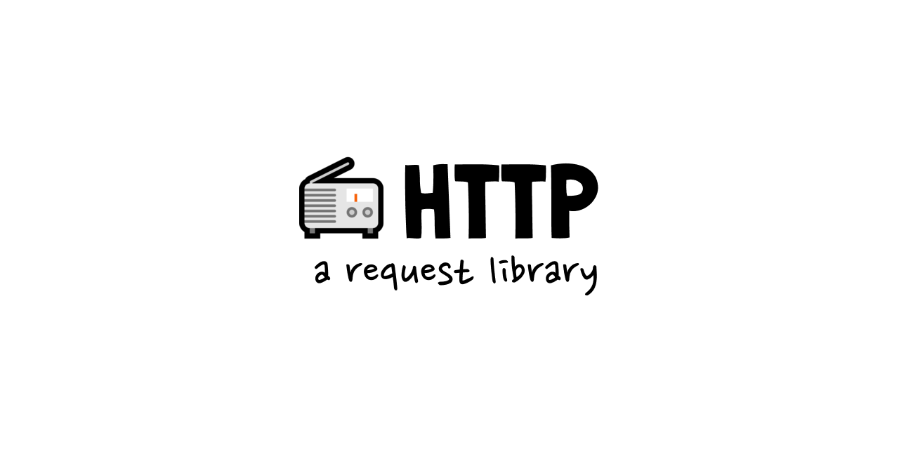

# 📻 http

[![version][version-badge]][npm]
[![downloads][downloads-badge]][npm]
[![size][size-badge]][bundlephobia]
[![github actions][github-actions-badge]][github-actions]
[![coverage][codecov-badge]][codecov]
[![typescript][typescript-badge]][typescript]
[![contributing][contributing-badge]][contributing]
[![contributors][contributors-badge]][contributors]
[![discord][discord-badge]][discord]

_📻 http request library heavily inspired by [axios][axios]._

Most of the time, `fetch` is used to interact with a JSON API. This library is a thin wrapper around `fetch` that converts the request and response body to JSON by default.

<p align="center">
    <a href="https://www.npmjs.com/package/@bradgarropy/http">
        
    </a>
</p>

## 📦 Installation

This package is hosted on [npm][npm].

```bash
npm install @bradgarropy/http
```

## 🥑 Usage

This library's API is very similar to [axios][axios]. You can issue HTTP requests which are assumed to be JSON by default. It returns a `Promise` with the response data.

```javascript
// get all posts
const posts = await get("https://jsonplaceholder.typicode.com/posts")

// get posts by user
const posts = await get("https://jsonplaceholder.typicode.com/posts", {
    params: {
        userId: 1,
    },
})

// get one post
const post = await get("https://jsonplaceholder.typicode.com/posts/1")

// create a post
const newPost = await post("https://jsonplaceholder.typicode.com/posts", {
    body: {
        title: "My post title",
        body: "This is my post body.",
        userId: 1,
    },
})
```

## 📖 API Reference

### `get(url, options)`

| Name              | Required | Default | Example                                      | Description                         |
| ----------------- | -------- | ------- | -------------------------------------------- | ----------------------------------- |
| `url`             | `true`   |         | `https://jsonplaceholder.typicode.com/posts` | Web address of the API.             |
| `options.headers` | `false`  | `{}`    | `{"content-type": "application/json"}`       | Headers object, similar to `fetch`. |
| `options.params`  | `false`  | `{}`    | `{userId: 1}`                                | Query parameters object.            |

Perform an HTTP GET request. The response is automatically converted to JSON.

```javascript
// get without options
get("https://jsonplaceholder.typicode.com/posts")

// get with  options
get("https://jsonplaceholder.typicode.com/posts", {
    headers: {"content-type": "application/json"},
    params: {userId: 1},
})
```

### `post(url, options)`

| Name              | Required | Default | Example                                      | Description                         |
| ----------------- | -------- | ------- | -------------------------------------------- | ----------------------------------- |
| `url`             | `true`   |         | `https://jsonplaceholder.typicode.com/posts` | Web address of the API.             |
| `options.headers` | `false`  | `{}`    | `{"content-type": "application/json"}`       | Headers object, similar to `fetch`. |
| `options.params`  | `false`  | `{}`    | `{userId: 1}`                                | Query parameters object.            |
| `options.body`    | `false`  | `{}`    | `{first: "Brad", last: "Garropy"}`           | JSON body to send to the API.       |

Perform an HTTP POST request. If a `body` is supplied, it's automatically converted to a string before being sent in the request. The response is automatically converted to JSON.

```javascript
// post without options
post("https://jsonplaceholder.typicode.com/posts")

// post with options
post("https://jsonplaceholder.typicode.com/posts", {
    headers: {"content-type": "application/json"},
    params: {userId: 1},
    body: {
        first: "Brad",
        last: "Garropy",
    },
})
```

## ❔ Questions

🐛 report bugs by filing [issues][issues]  
📢 provide feedback with [issues][issues] or on [twitter][twitter]  
🙋🏼‍♂️ use my [ama][ama] or [twitter][twitter] to ask any other questions

## ✨ contributors

<!-- ALL-CONTRIBUTORS-LIST:START - Do not remove or modify this section -->
<!-- prettier-ignore-start -->
<!-- markdownlint-disable -->
<table>
  <tr>
    <td align="center"><a href="https://bradgarropy.com"><br /><sub><b>Brad Garropy</b></sub></a><br /><a href="https://github.com/bradgarropy/http/commits?author=bradgarropy" title="Code">💻</a> <a href="https://github.com/bradgarropy/http/commits?author=bradgarropy" title="Documentation">📖</a> <a href="https://github.com/bradgarropy/http/commits?author=bradgarropy" title="Tests">⚠️</a> <a href="#infra-bradgarropy" title="Infrastructure (Hosting, Build-Tools, etc)">🚇</a></td>
  </tr>
</table>

<!-- markdownlint-restore -->
<!-- prettier-ignore-end -->

<!-- ALL-CONTRIBUTORS-LIST:END -->

[codecov]: https://app.codecov.io/gh/bradgarropy/http
[contributing]: https://github.com/bradgarropy/http/blob/master/contributing.md
[contributors]: #-contributors
[npm]: https://www.npmjs.com/package/@bradgarropy/http
[codecov-badge]: https://img.shields.io/codecov/c/github/bradgarropy/http?style=flat-square
[version-badge]: https://img.shields.io/npm/v/@bradgarropy/http.svg?style=flat-square
[downloads-badge]: https://img.shields.io/npm/dt/@bradgarropy/http?style=flat-square
[contributing-badge]: https://img.shields.io/badge/PRs-welcome-success?style=flat-square
[contributors-badge]: https://img.shields.io/github/all-contributors/bradgarropy/http?style=flat-square
[issues]: https://github.com/bradgarropy/http/issues
[twitter]: https://twitter.com/bradgarropy
[ama]: https://bradgarropy.com/ama
[bundlephobia]: https://bundlephobia.com/result?p=@bradgarropy/http
[size-badge]: https://img.shields.io/bundlephobia/minzip/@bradgarropy/http?style=flat-square
[github-actions]: https://github.com/bradgarropy/http/actions
[github-actions-badge]: https://img.shields.io/github/workflow/status/bradgarropy/http/%F0%9F%9A%80%20release?style=flat-square
[typescript]: https://www.typescriptlang.org/dt/search?search=%40bradgarropy%2Fhttp
[typescript-badge]: https://img.shields.io/npm/types/@bradgarropy/http?style=flat-square
[discord]: https://bradgarropy.com/discord
[discord-badge]: https://img.shields.io/discord/748196643140010015?style=flat-square
[axios]: https://github.com/axios/axios
